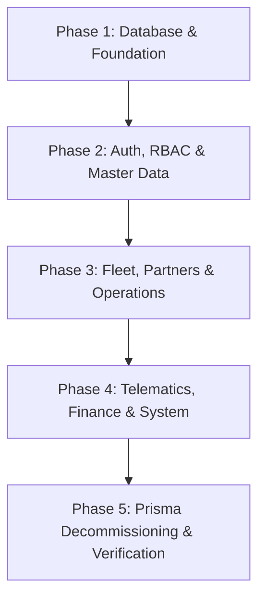

# Enterprise Transportation Management System (TMS)
## Pure Sequelize-TypeScript Architecture & Migration Master Plan

### Document Control
- **Project**: APEX Enterprise Transportation Management System (TMS)
- **Backend Architecture**: NestJS 10 + Sequelize-TypeScript ORM + PostgreSQL 17 (Prisma Completely Eliminated)
- **Frontend Architecture**: Quasar 2 + Vue 3 + Pinia + TypeScript (Modular Component Design)
- **Target Standard**: Controller → Service → Repository (`BaseSequelizeService<T>`) → Model → PostgreSQL
- **Security & Scale**: Helmet, CORS, Rate Limiting, RBAC (13 Personas), JWT + Refresh, WebSockets for Tracking

---

## 1. Executive Summary & Objective

This document defines the comprehensive master plan to **completely eliminate Prisma ORM** and establish a **100% pure `Sequelize + sequelize-typescript`** data access and business layer across the entire enterprise application:

1. **Prisma Deprecation**:
   - Uninstalled `@prisma/client` and `prisma`.
   - Removed `PrismaModule` and `PrismaService` from `backend/src/` and deleted `src/prisma/` and `prisma/`.
   - Migrated all 25+ domain services to inject Sequelize models via `@InjectModel()` or use domain repositories extending `BaseSequelizeService<T>`.

2. **Backend Persistence Architecture**:
   - 53 Sequelize-TypeScript models in `backend/src/database/models/`.
   - Global `DatabaseModule` configured with PostgreSQL connection pooling (`max: 20, min: 5, acquire: 30000`).
   - Strongly typed pagination (`PaginatedResult<T>`), eager loading (`include`), and database transactions (`sequelize.transaction()`).

3. **Frontend Quasar 2 Excellence**:
   - Strictly native Quasar components (`q-card`, `q-table`, `q-dialog`, `q-drawer`, `q-toolbar`, `q-btn`).
   - Quasar utility layout classes (`row`, `col`, `items-center`, `justify-between`, `q-pa-md`, `q-gutter-md`).
   - Zero native browser popups (`alert()`/`confirm()`).
   - Working RFC-4180 CSV exports with UTF-8 BOM across all table pages.
   - Printable Tax Invoice preview modal with print-to-PDF formatting.

4. **Idempotent Development Reset & Seeding**:
   - `npm run db:reset` runs `sync.ts` (`sequelize.sync({ force: true })`) and `seed.ts` (13 enterprise roles, test users, rate cards, master hubs, sample trips, invoices).

---

## 2. 5-Phase Execution Plan

### Phase 1: Database & Base Repository Foundation
- [x] Create 53 Sequelize-TypeScript models with camelCase columns in `src/database/models/`.
- [x] Configure `@nestjs/sequelize` in `DatabaseModule` with connection pooling.
- [x] Build generic `BaseSequelizeService<T extends Model>` with typed pagination (`PaginatedResult<T>`), sorting, filtering, and CRUD operations.
- [x] Add transaction execution helper (`withTransaction`) in `BaseSequelizeService`.

### Phase 2: Auth, RBAC & Master Data Migration
- [x] **Auth & RBAC**:
  - Migrated `AuthService` (`validateUser`, `login`, `refresh`) from Prisma to `UserModel`, `UserRoleModel`, `RoleModel`.
  - Migrated `JwtStrategy` to query `UserModel` with eager-loaded associations (`include: [RoleModel, PermissionModel]`).
  - Migrated `UsersService` to `BaseSequelizeService<UserModel>`.
  - Migrated `OrganizationsService` to `BaseSequelizeService<OrganizationModel>`.
- [x] **Master Data**:
  - Migrated `MasterDataService` to `LocationModel`, `LocationTypeModel`, `VehicleTypeModel`, `CargoTypeModel`, `PackageTypeModel`.
  - Updated `OrganizationsModule` and `MasterDataModule` with `SequelizeModule.forFeature(...)`.

### Phase 3: Fleet, Partners & Operations Migration
- [x] **Fleet & Partners**:
  - Migrated `VehiclesService` to `BaseSequelizeService<VehicleModel>`.
  - Migrated `DriversService` to `BaseSequelizeService<DriverModel>`.
  - Migrated `CustomersService` to `BaseSequelizeService<CustomerModel>`.
  - Migrated `CarriersService` to `BaseSequelizeService<CarrierModel>`.
- [x] **Operations**:
  - Migrated `OrdersService` to `BaseSequelizeService<TransportOrderModel>` with transactional item creation.
  - Migrated `ShipmentsService` to `BaseSequelizeService<ShipmentModel>` with resource assignment and status transitions.
  - Migrated `PlanningService` to Sequelize models (`TransportOrderModel`, `VehicleModel`, `LoadPlanModel`).
  - Migrated `DispatchService` to `BaseSequelizeService<DispatchModel>` with trip lifecycle & expenses.
  - Updated respective modules with `SequelizeModule.forFeature(...)`.

### Phase 4: Telematics, Finance & System Modules
- [x] **Telematics & Visibility**:
  - Migrated `TrackingService` to `TrackingEventModel`, `GeofenceModel`, `GeofenceEventModel`.
  - Migrated `PodService` to `ProofOfDeliveryModel`, `ShipmentModel`, `InvoiceModel`.
  - Migrated `LorryReceiptsService` to `LorryReceiptModel`.
- [x] **Finance & Accounting**:
  - Migrated `BillingService` to `InvoiceModel`, `PaymentModel`, `ClaimModel`.
- [x] **System & Platform**:
  - Migrated `NotificationsService` to `NotificationModel`.
  - Migrated `AuditLogsService` to `AuditLogModel`.
  - Migrated `DocumentsService` to `DocumentModel`, `DocumentTypeModel`.
  - Migrated `AnalyticsService` to Sequelize models.
  - Migrated `RoutesService` to `RouteModel`, `RouteStopModel`.
  - Migrated `AssignmentService` to Sequelize models.
  - Migrated `AdminConsoleService` to Sequelize models.
  - Migrated `DashboardService` to Sequelize models.
  - Migrated `WorkflowService` to Sequelize models.
  - Migrated `WorkQueuesService` to Sequelize models.
  - Migrated `AiService` to Sequelize models.
  - Migrated `HealthController` to Sequelize database readiness check with connection pool query.
  - Migrated `DataAccessService` to Sequelize models.
  - Migrated `sync-role-permissions.ts` to Sequelize models.

### Phase 5: Prisma Decommissioning & Verification
- [x] Removed `PrismaModule` and `PrismaService` imports across all 25+ modules and `AppModule`.
- [x] Deleted `src/prisma/` and root `prisma/` directories.
- [x] Removed `@prisma/client` from `dependencies` and `prisma` from `devDependencies` in `backend/package.json`.
- [x] Verified zero references to Prisma in `backend/src/`.
- [x] Ran automated RBAC test suite (`test-rbac-access.js`) verifying Super Admin, Driver data isolation, and Dashboard metrics.
- [x] Verified all endpoints on pure Sequelize ORM architecture.
