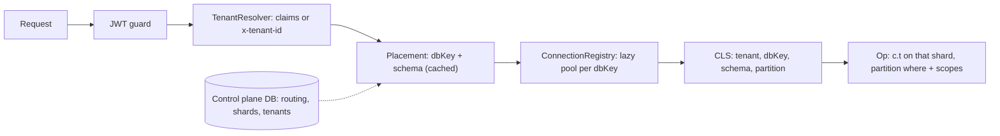
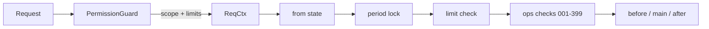

# Generic ops framework: scopes, limits, actions-in-data and the ERP gaps

## Goal

Today the framework lives in `server/src/common/crud/` and imports app code (for example, `crud-controller.ts` imports `AclService` from `modules/acl`). The goal is a **generic framework**: no TMS words in it and no imports from `modules/`. TMS and a rebuilt `nest-backend` then only declare entities, scopes, limits, settings and steps.

Decisions already made:

- When a user is over their limit, the operation is **blocked** (422). There is no pending or approve workflow yet. Limits are stored and evaluated so a later "route to approver" can replace the block without changing what entities declare.
- The ERP gaps from `nest-backend` go into this plan.

## 1. Framework boundary

- Move the generic parts into `server/src/framework/`:
  - `crud/`
  - `audit/`
  - `sequences/`
  - `notify/`
  - the ACL core: effective permissions, scopes, limits and the guard
  - new `settings/` and `periods/`
- Apps (TMS modules) supply the parts that are specific to them:
  - the resource catalog (today `modules/acl/registry/groups.ts`)
  - default roles
  - their own scope providers
- Everything the framework needs from the app comes through `FrameworkModule.forRoot({ catalog, scopes, userClaims })`.
- Add `framework/boundary.spec.ts`. It fails when any file under `framework/` imports from `modules/`.
- A separate npm package comes later. This plan only keeps the folder package-ready.
- Update `server/docs/ops.md` in the same change, and regenerate `entity-flow.md` with `npm run flow`.

## 2. Tenancy: partition column, placement and control plane

Tenancy is split into two independent parts, so one framework covers both apps:

- **Partition**: which rows inside a database belong to the caller. TMS uses `organizationId`; nest-backend uses `companyId`.
- **Placement**: which database and schema hold that tenant. TMS uses one database and the `public` schema. nest-backend sends `x-tenant-id`, which names a schema; `ankpal.TenantRouting` on the primary database maps that schema to a shard `dbKey`, and the shard connection is opened lazily.



### 2a. Partition column, defined by the app

The app declares the column once:

```ts
FrameworkModule.forRoot({
  tenancy: {
    partition: { field: 'organizationId', column: 'organization_id', fromUser: (u) => u.organizationId },
    // nest-backend: { field: 'companyId', column: 'company_id', fromUser: (u) => u.companyId }
  },
});
```

- `TenantModel` stops hardcoding `organizationId`. A `partitionedModel()` mixin, or a base built from the config, adds the column and its index.
- Everything that used `organizationId` reads the configured partition instead:
  - `scopeWhere`
  - `findOne`
  - `create`
  - `unique`
  - `count`
  - audit
  - sequences
  - ACL tables
  - settings
  - period locks
- `AuthUser` becomes generic: `{ id, tenant: TenantRef, partition: Record<string, number | string>, branchIds, roleId, aclVersion, ... }`. Each app maps its JWT claims through `userClaims`.
- The ACL cache key includes the tenant key and the partition, so two tenants with the same user or role ids never share an entry.
- Partitioning is **always on**, including in a dedicated schema or database that holds a single company. Every tenant row carries the company column. This lets a company move from shared to separate, or merge from separate into shared, without changing its rows.
- **Company ids are global.**
  - A company is registered in the control plane, and its id comes from there.
  - The same id is written explicitly into the tenant's `organizations` mirror table, which has no auto-increment, and into every partition column.
  - No tenant database ever generates a company id.
- **Other tenant rows keep local auto-increment ids**: branches, users, roles, documents and so on. Ids can repeat across tenant schemas and databases.
- **Users** follow the nest-backend tenant `User` and `ankpalUserId` pattern:
  - Each tenant `users` row has its own local `id`.
  - It also has `platformUserId`, the control-plane user id.
  - It is unique on `(organization_id, platform_user_id)` and on `(organization_id, email)`.
  - Tenant-side references (`createdById`, audit, ACL) use the local id. The company token carries both ids.

### 2b. Placement and connections (multi-DB ready, used by TMS in single mode)

- `TenantResolver` (app-supplied) turns the request into a `TenantRef`.
  - TMS: from the JWT claim.
  - nest-backend: from `x-tenant-id`, plus `x-company-id` for the partition.
  - The header is always checked against the user's memberships. A header alone never selects a tenant.
- `PlacementResolver` turns a `TenantRef` into `{ dbKey, schema }`.
  - Strategies: `single` (TMS now), `schemaPerTenant`, and `routed`. `routed` reads a routing table on the control plane and caches it with a TTL and explicit invalidation.
  - A tenant in a draining or missing route is refused with 503 or 404. It never falls back to primary.
- `ConnectionRegistry` holds one pool per `dbKey`:
  - lazy creation with an init lock
  - the Nest connection adopted as `primary`, so there is never a second pool to the same database
  - per-shard pool sizes, for example a smaller pool for on-prem
  - URIs from env or the shard row, decrypted when needed
  - closed on shutdown

  This follows the lessons from nest-backend's `tenant-sequelize.registry.ts`.
- Request context uses `nestjs-cls` (AsyncLocalStorage), not `Scope.REQUEST` providers, so there is no per-request DI cost.
- **Every framework query goes through the op's connection.**
  - The op transaction `c.t` is opened on the tenant's shard.
  - For schema placement it runs `SET LOCAL search_path TO "<schema>", public` once, so steps' raw SQL needs no schema prefix.
  - ORM calls use a cached `Model.schema(schema)` clone per `(dbKey, schema)`, created by `c.model(Branch)` and the service's `this.repo(ctx)`.
  - Reads without steps (plain lists, `get`) use the same resolver.
- Unlike nest-backend, the framework does not patch `Model.sequelize`. Models are registered on each shard with `modelManager.addModel`, never re-initialized.
- Two guards are kept as safety nets:
  - a cross-database query guard, which refuses a query on a connection that does not own the request's `dbKey`
  - a control-plane foreign-transaction guard
- Background work uses `runInTenant(ref, fn)` and `forEachTenant(fn)`, which go across shards and are used by schedulers and `afterCommit` jobs. CLS is set the same way as for a request.

### 2c. Control plane

- An optional, separately named connection, for example `control`, holds cross-tenant data: tenants, routing, shards, licenses, global users. For nest-backend this is the `ankpal` schema on primary.
- Control-plane models never take an op's `c.t`. Mixing them in throws, as nest-backend's `installAnkpalForeignTransactionGuard` does. Atomic control-plane writes open their own control transaction, exposed as `c.control(work)`.
- In TMS the control plane is the `platform` schema, and it is used from the start (section 2e). The `control` connection defaults to the primary pool with `schema: 'platform'`, so there is no second pool. Setting `CONTROL_DB_URI` later moves it to its own database with no code change.

### 2d. Schema lifecycle (seams; TMS keeps `sync`)

- `provisionTenant(ref)` creates the schema from the template, or does nothing in `single` mode, then runs the app's provisioner. TMS's `OrganizationProvisioner` plugs in here.
- A schema-parity check against the template runs once per `(dbKey, schema)`, the same as nest-backend's `checkSchemaParityOnce`.
- A per-shard and per-schema migration runner comes later. While TMS has no production DB it keeps `db:reset` and `DB_SYNC=alter`.
- **Move and merge tool**, built now as a framework CLI and service, because it relies on rules that must hold from day one. `moveCompany(orgId, { to: { dbKey, schema } })`:
  1. Mark routing `migrating`. Writes for that company are refused with 503.
  2. Read the tenant models in FK dependency order, worked out from sequelize-typescript association and `references` metadata.
  3. Copy the company's rows, filtered by the partition column, into the target.
  4. **Remap ids.** Each table gets new ids in the target, and an old-to-new map rewrites every FK column that points at it. The partition column (global id) and `platformUserId` are never remapped.
  5. Polymorphic references, such as `entity_events.entity_type` / `entity_id`, are remapped through their declared type map.
  6. Verify row counts and FK integrity in the target, then switch routing to the target as `active`, clear the placement cache, and delete the source rows.
  7. The source data is the rollback until the switch is made.
- Rules every model must follow so remapping works:
  - Every FK is declared, through an association or `ref()`.
  - Polymorphic id columns are registered with the framework.
  - No ids are stored inside JSON unless the column is declared remappable.
  - Document numbers are values, not ids, so they are copied unchanged.
- A boot check fails on a tenant model that has an undeclared `...Id` integer column, unless it is marked `notARef`.
- `DB_SYNC=alter` at boot syncs platform models into `platform`, and tenant models into every active schema in `tenant_routing`, which for TMS today is only `tenant_shared`.

### 2e. TMS uses the platform / tenant split now (multi-DB from the ground up)

Two Postgres schemas in the one TMS database:

- **`platform`** is the control plane, the equivalent of nest-backend's `ankpal` schema. It holds cross-tenant data:
  - `users`: global identity, with email, password hash, name, phone and status. Email is unique across the platform.
  - `organizations`: the tenants. This table is the only source of company ids, which are global. The tenant schema keeps a mirror that has the same id.
  - `user_organizations`: memberships, with status `active`, `invited`, `blocked` or `pending`, `isDefault`, `lastUsedAt`, and an optional `accessExpiresAt`. This matches `AnkpalUserCompanyAssociation`.
  - `refresh_tokens`: sessions belong to the identity and carry the chosen organization.
  - `licenses`, the plan catalog: code, name, seats, modules and duration.
  - `organization_licenses`: organization, license, seats, `validFrom` / `validTo` and status.
  - `tenant_routing`: `organizationId`, `dbKey`, `schema` and status (`creating`, `active`, `migrating`, `disabled`). The schema value can be `tenant_shared` or a dedicated schema.
  - `tenant_shards`: `dbKey`, type (`cloud` or `onprem`), status, an encrypted `connectionUri` and `maxTenants`.
- **`tenant_shared`** holds every tenant table for all organizations, partitioned by `organization_id`:
  - branches
  - roles, permissions and `role_permissions`
  - `user_permission_overrides`
  - the tenant `users` profile
  - `user_branches`
  - `entity_events`
  - document sequences
  - settings
  - period locks
  - ERP and exception tables
  - every future business table

  One organization can later be moved to its own schema or database by copying its rows and changing its `tenant_routing` row. No code changes.

Rules that keep it movable:

- **No foreign keys and no SQL joins between `platform` and tenant schemas.**
  - Each tenant schema has its own `organizations` mirror, with the same id as the platform row. It holds the company's tenant-side profile: GSTIN, address and print details.
  - `TenantModel.organizationId` references that **local mirror**. The FK stays inside the schema, so it moves with the company.
  - The mirror row is written by `provisionTenant`, and updated when the platform company changes.
- The tenant `users` row is the user's **profile inside that organization**, with its own local id:
  - `platformUserId`, unique per organization
  - `code`, `roleId`, `branchId`, `userType`, `partyId`, `status`, `lastLoginAt`
  - a copy of `name` and `email` for lists, kept in sync when the identity changes
  - `passwordHash` leaves the tenant table
- `createdById`, `updatedById`, audit and ACL keep using the tenant user id, so all tenant joins stay local.
- A write that touches both stores does not pretend to be one transaction. For example, an admin adds a user:
  1. `c.control(work)` finds or creates the identity by email, and upserts the membership as `pending`. This step is idempotent.
  2. The tenant write runs in `c.t`.
  3. `afterCommit` marks the membership `active`.

  If the tenant write fails, the only thing left behind is a pending membership. It does nothing and is reused on retry.

Auth flow:

Login uses two kinds of token, the same as nest-backend's `login` / `switch-company` with `JwtSwitchCompanyGuard`:

1. **`POST /auth/login`** takes email and password and checks them on `platform` only. It returns:
   - a **login token**, which is short-lived (about 15 minutes) and has claims `{ sub: platformUserId, typ: 'login' }`
   - the user's companies, read from `user_organizations` joined to `organizations` and `organization_licenses`. All three are in `platform`, so this is a local join. Each entry has `{ id, code, name, role label, status, licenseValidTo, lastUsedAt, isDefault }`.

   Blocked memberships and companies with an expired license are listed but disabled, with the reason.
2. **`GET /auth/companies`**, using the login token or the company token, returns the same list. The picker and the switch menu use it.
3. **`POST /auth/switch-company { organizationId }`**, using the login token or the company token:
   - checks the membership, the license and the seat count
   - resolves placement
   - loads the tenant user profile in that company's shard and schema
   - issues a **company token** and a refresh token
   - updates `lastUsedAt`

   Calling it while already in a company is how switching works: the old refresh token is revoked and a new pair is issued.
- **Token claims.**
  - Login tokens are refused on every tenant route, and company tokens are what tenant routes require.
  - The company token keeps the claims TMS has today: `sub`, `uid`, `org`, branches, role and `aclVersion`, plus `typ: 'access'`. Here `sub` is the platform user id and `uid` is the tenant user id.
  - A refresh token belongs to one company session.
- `TenantResolver` reads `org` from the company token. `PlacementResolver` then looks up its `tenant_routing` row (cached) to get `{ dbKey: 'primary', schema: 'tenant_shared' }`.
- Registration later reuses `switch-company` right after it provisions the company.
- Login and refresh refuse an organization whose license has expired or is suspended. Activating a membership checks the seat count. This is the minimum check; feature gating by `modules` is a seam.
- Registration is not built now; only seeding is. It will run: platform identity, then organization, then routing (`creating`), then `provisionTenant` (tenant rows), then routing `active`.

Seed (`npm run db:reset`):

1. Drop and recreate the `platform` and `tenant_shared` schemas.
2. Sync platform models into `platform` and tenant models into `tenant_shared`.
3. Sync the permission catalog into the tenant schema.
4. Seed a trial license and the `primary` shard row.
5. Seed the `demo` organization with routing to `tenant_shared`, its license, branches, roles, the 7 demo identities, their memberships and tenant users.
6. Seed a second organization, `demo2`, where `admin@demo.test` is also a member. This exercises the organization picker and proves tenant isolation.

Frontend:

- After login, a **company picker** is always shown, even when there is only one company.
  - It is a keyboard-first desk list: arrow keys and type-to-filter, Enter opens the company, Esc logs out.
  - The last-used company is pre-selected, and each row shows its role and license validity.
  - The login form no longer asks for an organization code.
- **Switch company**:
  - in the app header with a desk shortcut, for example Alt+F3
  - it opens the same picker as a dialog
  - on Enter it calls `switch-company`, replaces the tokens, clears cached resource data and reloads the menu and permissions for the new company
- The auth store keeps the login token only for as long as the picker is open. After that it keeps the company token pair. `me` returns the active company.

Raw SQL in modules:

- Modules stop using `@InjectConnection()` directly for tenant tables. Examples are `AclService.load`, `history()`, and steps like `510-after-add-user-count.ts`.
- They use `c.t`, or `TenantDb.query(sql, { t })` outside an op. Both run on the tenant's shard with its `search_path`.
- A spec flags new direct uses in `modules/`.

## 3. Pluggable scopes (replaces the fixed `all | branch | own`)

- `AclScope` becomes `string`.
- A scope is a provider:

```ts
export interface ScopeDef<M = TenantModel> {
  id: string; // 'all', 'branch', 'own', 'active-only'
  label: string;
  /** Extra where for list/get/write; null means no limit beyond the tenant. */
  where(ctx: ReqCtx, model: ModelStatic<M>): WhereOptions | null;
  /** Same rule for one loaded row (actions-in-data, checks), no query. */
  allows?(ctx: ReqCtx, row: M): boolean;
}
```

- Built-in scopes are `all`, `branch` and `own`. `branch` only applies when the model has `branchId`, which works the same for TMS and for nest-backend branches.
- A service declares extra scopes for its own resource only:

```ts
protected readonly scopes = ['all', 'branch', 'own', activeOnly];
```

This covers "only on some entities".

- `scopeWhere` in `tenant-crud.service.ts` looks up `ctx.scope` in the resource's scope list. An unknown scope is denied, never treated as `all`.
- The catalog endpoint returns `scopes` per resource. The matrix dropdown in `frontend/src/pages/admin/roles/PermissionMatrix.vue` shows only that row's scopes.
- In the database, `role_permissions.scope` and `user_permission_overrides.scope` become `STRING(40)`. DTO validation checks the value against the resource's scopes in a check step of `role-ops/save/`.

## 4. Authority limits on grants

Entities declare what can be limited, on an action or on a CRUD permission:

```ts
{
  name: 'approve',
  label: 'Approve',
  from: { status: ['draft'] },
  limits: [
    { key: 'amount', label: 'Up to amount', type: 'money', value: (row) => Number(row.totalAmount) },
  ],
}
```

- Limits can also be declared for `create`, `update` and `delete` through the service: `protected readonly limits = { update: [...] }`.
- Storage: a new `limits JSONB` column on `role_permissions` and `user_permission_overrides`, for example `{ "amount": 5000 }`. An empty value means unlimited.
- `AclService.effective()` returns `Map<code, { scope, limits }>`. The guard puts both on the request, and `c.limits` reaches every step.
- A built-in framework check runs before step 001 of every row operation and bulk action. For each declared limit with a stored value, it blocks when `value(row) > limit`:

```ts
issues.block(
  "limit_exceeded",
  "Approve is allowed up to 5,000; this invoice is 8,000",
);
```

For bulk actions the blockers are reported per record, as they are today.

- `describeFlow` and the generated flow document list each operation's limits.
- UI:
  - The role matrix gets a **Limit** column.
  - The column is editable only on rows whose permission declares limits. Other rows show `—`.
  - One numeric limit edits inline. More than one limit opens a small desk dialog with F2.
  - The user-override screen gets the same column.



## 5. Actions in data (keep `GET /actions` too)

- `GET /:id` and `GET /` accept `?actions=1`. Each row then gets:

```ts
_actions: { approve: { allowed: false, reason: 'Above your limit of 5,000' }, ... }
```

- The result is computed in memory, with no query per row, from:
  - permission and scope (`ScopeDef.allows`)
  - `from`
  - limits
  - period lock
  - an optional `available(row, ctx): string | null` on the action
- Check steps are not run here. The real call still runs them.
- `GET /actions` stays as action metadata.
- `frontend/src/desk/tms/components/ResourcePage.vue` uses `_actions` when it is present, so buttons show disabled with the reason as a tooltip. It falls back to `from`.

## 6. Richer action metadata (from nest-backend `ActionDTO`)

- Add these optional fields to `EntityAction` and `ActionInfo` in `entity-action.ts`:
  - `icon`
  - `shortcut` (desk key)
  - `ui: 'confirm' | 'form' | 'silent'`
  - `group` / `display: 'toolbar' | 'menu'`
  - `hideInAcl`
- Existing `inputs` and `input` remain the form.
- Frontend desk action buttons and menus read these fields.

## 7. Period lock (nest-backend `requiresFYBasedAction`)

- Generic, with no financial-year wording in the framework.
- A service declares the date that decides its period: `protected readonly periodField = 'invoiceDate'`.
- A new `period_locks` table holds rows per partition (organization or company): `lockedUntil`, plus an optional branch.
- A built-in check blocks create, update, delete and actions when the record's date, stored or new, is on or before the lock.
- An action can opt out with `ignoresPeriodLock: true`, for example a reopen action.
- A `period.unlock` permission allows the override.
- Add a desk settings page to set the lock.

## 8. Tenant settings (nest-backend `configBased` ACL and company settings)

- A typed settings registry declared in code:

```ts
defineSetting({ key: "branch.scopeEnabled", type: "boolean", default: true });
```

- Values are stored as JSONB in a `tenant_settings` table, keyed by partition.
- Steps read settings with `c.setting('key')`, cached per request.
- `ScopeDef.where`, `available()` and `when` can depend on settings. This replaces `acl.level: 'configBased'` and `settingPath`.
- Add a generic desk settings form generated from the registry.

## 9. Soft delete and restore

- A service sets `protected readonly softDelete = true`, and the model uses `paranoid`.
- Lists and gets exclude deleted rows unless the request has `?deleted=1` and the caller holds `<resource>.restore`.
- A `restore` action is generated automatically and audited.
- `dependents` checks ignore soft-deleted rows.

## 10. Seams for later (no work now)

The design leaves room for these without implementing them:

- Approval routing on `limit_exceeded`
- A migration runner per shard and per schema (section 2d)
- Read replicas: `PlacementResolver` can return a read `dbKey` for lists and views
- Realtime pushes after commit
- Import and export as collection actions
- Attachments
- Print layouts as `view-print`

## Testing and data

- Unit specs with `fakeOpContext` cover:
  - limits pass and block, including bulk
  - custom scope where and allows
  - period lock
  - `_actions` computation
  - the boundary spec
  - tenancy:
    - the partition `where` is always applied, with a custom partition field
    - a header that does not match the user's memberships is refused
    - placement never falls back to primary
    - `schemaPerTenant` sets `search_path` on `c.t`
    - the cross-DB guard refuses a query on the wrong shard
    - the ACL cache is keyed by tenant
- An integration spec on the local Postgres covers:
  - two organizations in `tenant_shared` are isolated by partition
  - a third organization routed to its own schema is isolated by placement
  - login returns the company list
  - a login token is refused on tenant routes
  - `switch-company` between `demo` and `demo2` changes the data
  - a company token cannot reach another company's rows
  - `moveCompany`:
    - moving `demo2` from `tenant_shared` to its own schema and back keeps every FK and the history intact, with ids remapped
    - merging into a schema whose ids collide succeeds
    - writes during `migrating` get 503
  - the boot check fails on an undeclared `...Id` column
  - the pending-membership write, including a tenant rollback
- Run `npm run db:reset` to wipe and reseed. Seeded roles get sample limits; for example, `ACCOUNTS` gets `invoice.approve` up to 50,000 once that module exists, and the limits are shown on existing actions until then.
- Run `typecheck`, `lint` and `test`.
