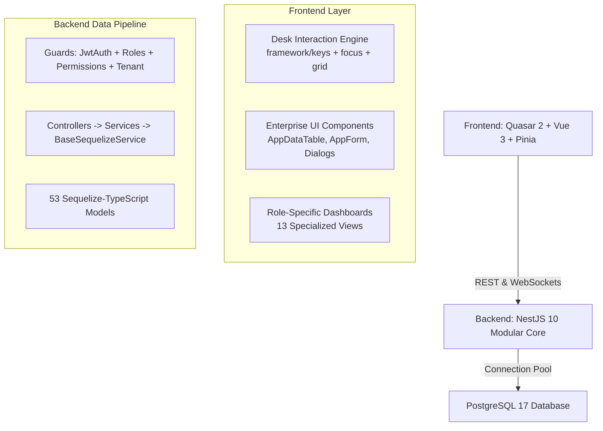
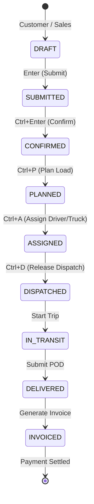

# Enterprise Transportation Management System (TMS)
## Master Implementation & Keyboard-First Desk Architecture Plan

### Executive Summary & System Identity
- **Product**: APEX Enterprise Transportation Management System (TMS)
- **Target Standard**: Real-world, high-throughput logistics ERP with dense data display, WCAG 2.2 AA accessibility, and sub-100ms keyboard navigation.
- **Frontend Stack**: Vue 3 + Quasar 2 + Pinia + Vite + TypeScript (Single-Page Desktop & Mobile Responsive)
- **Backend Stack**: NestJS 10 + Sequelize-TypeScript ORM + PostgreSQL 17 (Prisma 100% Decommissioned)
- **Interaction Foundation**: Desk Framework (`framework/layout`, `framework/keys`, `framework/focus`, `framework/grid`, `framework/form`, `framework/menu`)
- **Security & Authorization**: Multi-Tenant Data Scope + 13 Role Personas + Granular Resource/Action Permissions (`@RequirePermission()`)

---

## 1. Complete Project Audit & Current Architecture



### 1.1 Backend State (Audit Verified)
1. **Zero Prisma**: All Prisma packages (`@prisma/client`, `prisma`), modules, and service references have been 100% removed and deleted.
2. **53 Sequelize-TypeScript Models**: Fully unified in `backend/src/database/models/` with camelCase columns and string UUID primary keys (`DataType.STRING`).
3. **Database Connectivity**: Global `DatabaseModule` manages PostgreSQL pooling (`min: 5, max: 20, acquire: 30000`). Database health probe `GET /health/ready` returns `{"status":"ready","database":"up"}`.
4. **Multi-Tenancy & Data Scopes**: `DataAccessService` resolves scopes across `SYSTEM`, `ORGANIZATION`, `BRANCH`, `CARRIER`, `CUSTOMER`, `DRIVER`, and `SELF`.
5. **Role-Based Access Control (RBAC)**: All 13 TMS personas (`SUPER_ADMIN`, `TMS_ADMIN`, `OPERATIONS_MANAGER`, `TRANSPORT_PLANNER`, `DISPATCHER`, `FLEET_MANAGER`, `DRIVER`, `CARRIER`, `CUSTOMER`, `FINANCE_MANAGER`, `COMPLIANCE_MANAGER`, `SUPPORT_AGENT`, `ANALYST`) seeded with granular permissions.

### 1.2 Frontend State & Opportunities
1. **Styling & Layout**: Global dark cyber logistics theme with Quasar 2 classes and CSS variables in `tokens.css` and `app.scss`.
2. **Modals & Dialogs**: All native browser popups (`alert()`/`confirm()`) have been eliminated in favor of Quasar `<q-dialog>`, `<BaseConfirmDialog>`, and `$q.notify`.
3. **Data Export & Invoices**: Real RFC-4180 CSV export with UTF-8 BOM (`exportToCsv.ts`) and Tax Invoice PDF printable modal (`AppInvoicePreviewDialog.vue`).
4. **Current Keyboard Gap**: Keyboard navigation currently exists in isolated components (`CommandPalette.vue` with Ctrl+K, custom Arrow navigation in specific lists). The project needs the unified, modular **Desk Framework** to provide keyboard-first enterprise data entry, grid cell navigation, and dialog focus traps across all TMS screens.

---

## 2. The Desk Interaction Framework Architecture

To provide an SAP/Oracle ERP-grade desktop experience for logistics dispatchers and planners who operate 8+ hours a day, we establish the modular **Desk Framework** in `frontend/src/framework/`:

```text
frontend/src/framework/
├── layout/                  # Desktop window & layer manager
│   ├── DeskShell.vue        # Master enterprise workbench wrapper
│   ├── DeskPageLayer.vue    # Layered stacking (main page, drawer, flyout)
│   └── layers.ts            # Active layer stack management & z-indexing
├── keys/                    # Keyboard event dispatcher & keymaps
│   ├── keyboard.ts          # Root keyboard listener & event lifecycle
│   ├── dispatcher.ts        # Context-aware shortcut routing
│   ├── keymap.ts            # Default enterprise shortcuts & commands
│   ├── deskKeymap.ts        # Layer-specific keyboard bindings
│   └── jump.ts              # Quick-jump navigation engine (Access keys / mnemonics)
├── focus/                   # Enterprise focus engine
│   ├── useDeskFocus.ts      # Focus traversal, capture, and restoration
│   ├── trap.ts              # Modal & dialog focus trap
│   └── focusRing.css        # High-contrast visible focus styling
├── grid/                    # Keyboard-navigable data grid engine
│   ├── DeskGrid.vue         # 2D cell-based keyboard grid
│   ├── DeskDataTable.vue    # High-density Quasar QTable extension
│   ├── useGridKeyboard.ts   # Arrow, F2 edit, Enter commit, Home/End, PgUp/PgDn
│   └── desk-grid.css        # Dense tabular typography & selected cell borders
├── form/                    # Rapid keyboard data entry
│   ├── DeskForm.vue         # Tab/Enter auto-advance form container
│   ├── DeskField.vue        # Standardized keyboard-first field wrapper
│   ├── DeskCombo.vue        # Dropdown with arrow selection & type-to-filter
│   └── DeskLookupBox.vue    # Entity search modal (Customer, Carrier, Vehicle)
├── menu/                    # Action bar & flyouts
│   ├── DeskMenuBar.vue      # Top action bar with Alt+key mnemonics
│   ├── DeskMenuFlyout.vue   # Keyboard-navigable cascading menus
│   └── deskMenu.ts          # Action registration & enablement logic
├── theme/                   # High-density design tokens
│   └── desk-tokens.css      # Compact padding, row heights (28px/32px), borders
└── storage/                 # Local persistence for column widths & filters
    └── tablePreferences.ts  # Pinia / LocalStorage grid layout persistence
```

---

## 3. Strict Keyboard Context & Event Dispatching Rules

### 3.1 Context Determination Hierarchy (Non-Negotiable)
Before handling any key event, the root dispatcher evaluates the `activeElement`:

```text
Event: keydown
  ↓
Is activeElement an editable text field (input, textarea, [contenteditable])?
  ├─ YES:
  │    ├─ Arrow keys (Left/Right/Up/Down) -> DO NOT INTERCEPT (allow native caret movement)
  │    ├─ Home / End / Backspace / Delete -> DO NOT INTERCEPT (allow native text editing)
  │    ├─ Ctrl+C / Ctrl+V / Ctrl+A -> DO NOT INTERCEPT (allow native clipboard/selection)
  │    ├─ Escape -> Blur input or cancel edit mode (conditional)
  │    ├─ Enter -> If inside a multiline textarea, allow newline; if inside single-line field, advance to next field
  │    └─ Tab -> Advance to next field or table cell
  │
  └─ NO (Table row, dialog container, action button, or background shell):
       ├─ Arrow keys -> Navigate grid cells or menu items
       ├─ F2 -> Enter edit mode for current cell
       ├─ Space -> Toggle row checkbox or button press
       ├─ Ctrl+S -> Global save action
       ├─ Ctrl+K -> Global search palette
       ├─ Escape -> Close uppermost layer / modal / flyout
       └─ Delete / Insert -> Delete or insert record
```

### 3.2 Anti-Patterns Strictly Banned
- ❌ **No Blanket `preventDefault()`**: Never call `event.preventDefault()` or `stopPropagation()` without first verifying that the current component owns that key combination in its current state.
- ❌ **No Global Event Scattering**: All keyboard listeners route through `framework/keys/dispatcher.ts`. Zero direct `window.addEventListener('keydown')` scattered inside arbitrary components.
- ❌ **No Vanishing Focus**: Whenever a modal, dialog, or drawer closes, focus is deterministically restored to the element that triggered it.

---

## 4. Keyboard UX Specifications for Core TMS Modules

### 4.1 Form Keyboard UX (`DeskForm.vue` & `DeskField.vue`)
- `Tab` / `Enter`: Moves focus sequentially to the next form field.
- `Shift + Tab`: Moves focus to the previous form field.
- `Ctrl + S`: Triggers form submission/save without requiring mouse click on "Save".
- `Esc`: Reverts changes or prompts confirmation to discard unsaved edits.
- `Validation Failure`: On failed submission, focus automatically jumps to the first invalid field, scrolls it into view, and displays the error tooltip.

### 4.2 Grid & Table Keyboard UX (`DeskGrid.vue` & `DeskDataTable.vue`)
Logistics operators spend hours viewing Orders, Shipments, and Dispatches.
- `Arrow Keys (Up/Down/Left/Right)`: Moves the active cell highlight across rows and columns.
- `F2` or `Enter`: Begins inline editing of the current cell (e.g. updating carrier rate or vehicle assignment).
- `Enter` (while editing): Commits the cell edit and advances selection down to the next row.
- `Tab` (while editing): Commits the cell edit and advances selection right to the next column.
- `Esc` (while editing): Cancels edit, restores original cell value, and returns to cell selection mode.
- `Space`: Toggles multi-selection checkbox for bulk operations (e.g. bulk dispatching 10 shipments).
- `Home` / `End`: Jumps to the first or last column in the current row.
- `Ctrl + Home` / `Ctrl + End`: Jumps to the top-left or bottom-right of the dataset.
- `Page Up` / `Page Down`: Scrolls one full viewport of rows while maintaining active column focus.

### 4.3 Modal & Dialog Keyboard UX (`DeskDialog.vue` & `AppDialog.vue`)
- **Initial Focus**: On open, focus jumps automatically to the primary input field or primary confirm button (not the close button).
- **Focus Trap**: `Tab` and `Shift + Tab` cycle strictly within the dialog; focus cannot escape to underlying obscured background pages.
- **`Enter`**: Executes primary action (e.g., "Confirm Dispatch", "Submit ePOD").
- **`Esc`**: Closes the dialog.
- **Focus Restoration**: On close, the element in the parent view that opened the dialog immediately regains focus.

### 4.4 Autocomplete & Lookup UX (`DeskLookupBox.vue`)
- Opening lookup (e.g. searching 5,000 customers or carrier lanes):
  - Focus opens immediately in the lookup search field.
  - Typing filters results with a 150ms debounce.
  - `Arrow Down` / `Arrow Up`: Moves highlight through the dropdown list.
  - `Enter`: Selects the highlighted entity and returns focus to the next form field.
  - `Esc`: Dismisses lookup without selection.

---

## 5. TMS Operational Workflow & 13 Personas Keyboard Mappings



### Role-Specific Keyboard Command Accelerators:
| Role Persona | Primary Keyboard Accelerators | Business Action |
|---|---|---|
| **TRANSPORT_PLANNER** | `Ctrl + P`<br>`Ctrl + O`<br>`Ctrl + Shift + A` | Open Planning Board<br>Consolidate selected orders into Load Plan<br>Auto-assign best carrier by lane rate |
| **DISPATCHER** | `Ctrl + D`<br>`Ctrl + L`<br>`F5` | Dispatch highlighted shipment<br>Open Live Tracking Satellite View<br>Refresh real-time telematics board |
| **FLEET_MANAGER** | `Ctrl + M`<br>`Ctrl + Shift + V` | Log vehicle maintenance<br>Add new fleet vehicle |
| **DRIVER** | `Space`<br>`Ctrl + Enter` | Toggle checkpoint checklist item<br>Submit delivery & trigger ePOD signature |
| **FINANCE_MANAGER** | `Ctrl + I`<br>`Ctrl + Shift + A` | Preview & Print Tax Invoice<br>Run Freight Audit variance check |
| **CUSTOMER** | `Ctrl + K`<br>`Ctrl + T` | Search active consignments<br>Track shipment on live radar |
| **SUPER_ADMIN** | `Ctrl + Shift + S`<br>`Ctrl + Shift + O` | Open System Console<br>Switch Organization context |

---

## 6. Phased Implementation Roadmap

### Step 1: Foundation & Core Desk Keyboard Engine
- [ ] Create `frontend/src/framework/keys/` (`keyboard.ts`, `dispatcher.ts`, `keymap.ts`, `deskKeymap.ts`).
- [ ] Create `frontend/src/framework/focus/` (`useDeskFocus.ts`, `trap.ts`, `focusRing.css`).
- [ ] Create `frontend/src/framework/theme/` (`desk-tokens.css`).
- [ ] Implement global key listener in `App.vue` routing through the dispatcher.

### Step 2: Form & Input Keyboard Components
- [ ] Build `DeskForm.vue` with automated Tab/Enter field traversal and validation jump.
- [ ] Build `DeskField.vue` wrapper for Quasar inputs (`q-input`, `q-select`).
- [ ] Build `DeskLookupBox.vue` for rapid entity searching (Customers, Carriers, Vehicles, Locations).

### Step 3: High-Density Keyboard Data Grid
- [ ] Build `DeskDataTable.vue` / `DeskGrid.vue` extending Quasar QTable with 2D arrow cell navigation, row selection via Space, and F2 edit mode.
- [ ] Apply to primary TMS tables: Orders Page, Shipments Page, Vehicles Page, Drivers Page.

### Step 4: Dialog & Layer Focus Management
- [ ] Enhance all modal dialogs (`AppDialog.vue`, `BaseConfirmDialog.vue`, `AppInvoicePreviewDialog.vue`, `AppSignatureCaptureDialog.vue`) with strict focus trap and opener focus restoration.

### Step 5: End-to-End Keyboard Regression & Accessibility Verification
- [ ] Verify mouse-free full journey: Login → Create Order → Plan Load → Assign Dispatch → Submit POD → Verify Invoice.
- [ ] Verify zero key hijacking in textareas and search bars.
- [ ] Validate WCAG 2.2 AA visible focus ring contrast.
